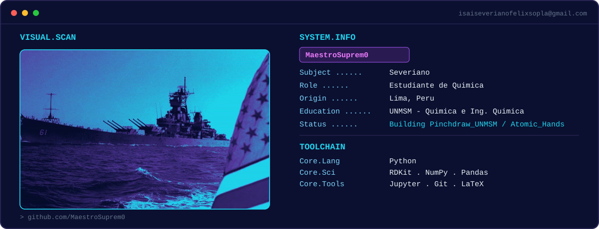

<!-- ====== BANNER ====== -->

  

<!-- ====== TERMINAL NEON (SVG propio) ====== -->

  

<!-- ====== STACK ====== -->
<h3 align="center">⚡ Stack</h3>

  

<!-- ====== STATS ====== -->

  
  

  

  

<!-- ====== SNAKE (requiere el workflow) ====== -->

  

<!-- ====== REPOS DESTACADOS ====== -->
<h3 align="center">🚀 Proyectos</h3>

  
  

<!-- ====== CONTACTO ====== -->
<h3 align="center">📡 Contacto</h3>

  
  

  

